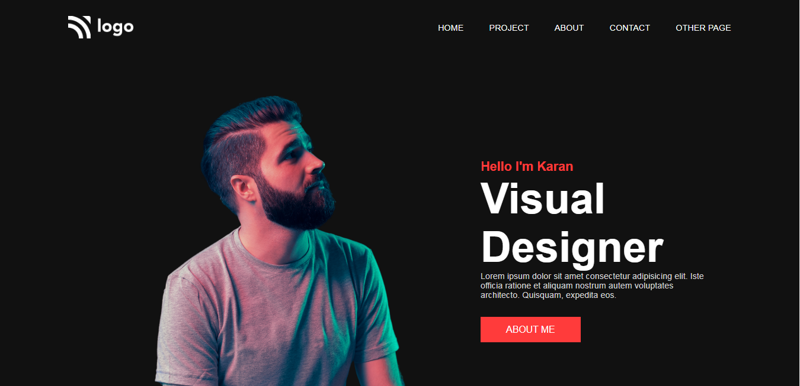
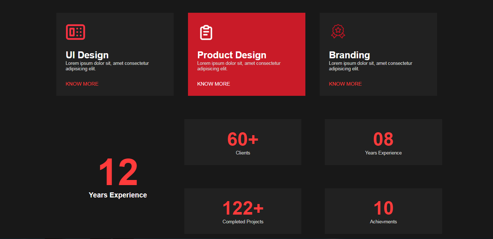
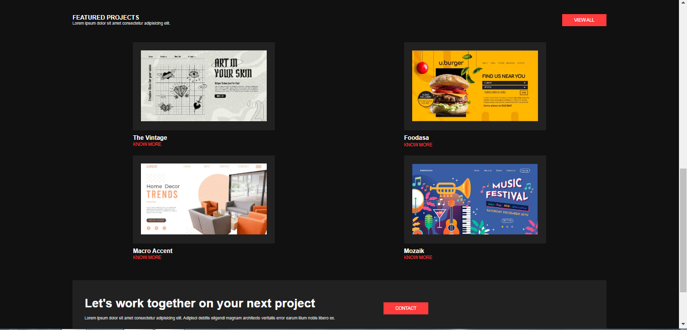

# Project - 15

### Designer

---

## About project
---

This project was made entirely with HTML.content with text and image both. background image is definding the content of the page very well. This page also has a customizable navigation bar. Used media queries for responsive designe.

---

## Learning Experience
---
This project taught me how to create portfolio using html.

## How Much Time I Took To Finish This Project...? 
>I worked on this project for three (3) hours in total. Yes, there were learning and exploring as well as mistakes.

---

##  Special Thanks To : [Hitesh Choudhary Sir](https://www.instagram.com/hiteshchoudharyofficial/?hl=en)  And [Ineuron](https://ineuron.ai/course/Full-Stack-Javascript-Web-Developer)

>Thank You Very Much For This Amazing Course.

---

## Screenshot 

# [Live Link](https://tranquil-croissant-7d712b.netlify.app/)
---

---

---

---

---
>## Who Am I ?

>My Name Is Karan I am A Learner Who is Interested in Sharing Knowledge About The Skills That I'm Developing to Become A Full-Stack Web Developer.

>## Check Out My Work on 

>[Netlify](https://app.netlify.com/teams/karan9846/overview?_ga=2.175703073.206776847.1659963657-634189433.1659791041)

>[FindCoder](https://www.findcoder.io/u/karan18)

>[hashnode](https://hashnode.com/@karan787)

>Let's get Connected [@karanjaria](https://www.instagram.com/karanjaria/?hl=en)